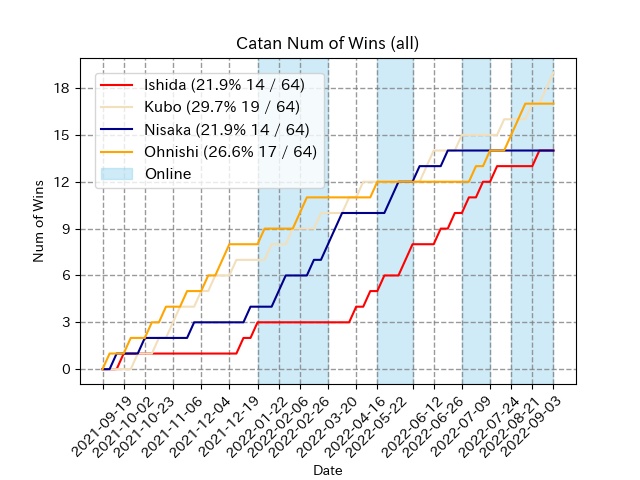

# カタン会リーグ成績（通算）
## 順位表
|   順 | プレイヤー   |   勝 |   敗 |   試合 |    勝率 | 差   | 首位差   | 対面    | オンライン   |   直近10 |
|----:|:--------|----:|----:|-----:|------:|:----|:------|:------|:--------|-------:|
|   1 | Kubo    |  22 |  45 |   67 | .328 | -   | -     | 16-42 | 6-25    |      6 |
|   2 | Ohnishi |  17 |  50 |   67 | .254 | 5   | 5     | 10-42 | 7-25    |      3 |
|   3 | Nisaka  |  14 |  53 |   67 | .209 | 3   | 8     | 8-42  | 6-25    |      0 |
|   3 | Ishida  |  14 |  53 |   67 | .209 | 0   | 8     | 8-42  | 6-25    |      1 |
## 勝ち数推移

### 記録（対面+オンライン）
|   順 | 連勝      |   試合数 | 開始           | 終了           |
|----:|:--------|------:|:-------------|:-------------|
|   1 | Kubo    |     5 | 2022-09-03_2 | 2022-09-18_3 |
|   2 | Ohnishi |     3 | 2022-07-24_3 | 2022-08-21_2 |
|   2 | Nisaka  |     3 | 2022-02-26_4 | 2022-03-20_2 |
|   4 | Ishida  |     2 | 2022-05-22_4 | 2022-05-22_5 |  

|   順 | 連敗      |   試合数 | 開始           | 終了           |
|----:|:--------|------:|:-------------|:-------------|
|   1 | Nisaka  |    18 | 2022-06-26_3 | 2022-09-18_3 |
|   2 | Ishida  |    16 | 2021-10-02_1 | 2021-12-19_1 |
|   3 | Ohnishi |    13 | 2022-05-22_1 | 2022-07-09_1 |
|   4 | Kubo    |     8 | 2022-04-16_2 | 2022-06-12_1 |
### 記録（対面）
|   順 | 連勝      |   試合数 | 開始           | 終了           |
|----:|:--------|------:|:-------------|:-------------|
|   1 | Kubo    |     3 | 2022-09-18_1 | 2022-09-18_3 |
|   2 | Ohnishi |     2 | 2021-12-04_3 | 2021-12-04_4 |
|   2 | Nisaka  |     2 | 2022-03-20_1 | 2022-03-20_2 |
|   4 | Ishida  |     1 | 2021-09-19_3 | 2021-09-19_3 |  

|   順 | 連敗      |   試合数 | 開始           | 終了           |
|----:|:--------|------:|:-------------|:-------------|
|   1 | Ishida  |    16 | 2021-10-02_1 | 2021-12-19_1 |
|   2 | Ohnishi |    10 | 2021-12-19_1 | 2022-04-16_2 |
|   3 | Nisaka  |     8 | 2022-06-26_3 | 2022-09-18_3 |
|   4 | Kubo    |     5 | 2021-12-19_2 | 2022-03-20_2 |
### 記録（オンライン）
|   順 | 連勝      |   試合数 | 開始           | 終了           |
|----:|:--------|------:|:-------------|:-------------|
|   1 | Ohnishi |     3 | 2022-07-09_4 | 2022-08-21_2 |
|   1 | Ishida  |     3 | 2022-05-22_4 | 2022-07-09_1 |
|   3 | Kubo    |     2 | 2022-09-03_2 | 2022-09-03_3 |
|   3 | Nisaka  |     2 | 2022-01-22_3 | 2022-02-06_1 |  

|   順 | 連敗      |   試合数 | 開始           | 終了           |
|----:|:--------|------:|:-------------|:-------------|
|   1 | Kubo    |    12 | 2022-02-26_4 | 2022-08-21_2 |
|   1 | Nisaka  |    12 | 2022-05-22_4 | 2022-09-03_3 |
|   3 | Ishida  |    10 | 2022-01-22_1 | 2022-02-26_4 |
|   4 | Ohnishi |     9 | 2022-02-26_2 | 2022-07-09_1 |
